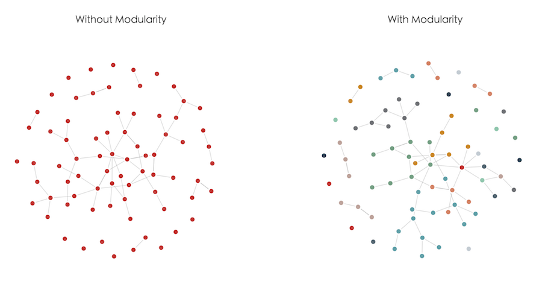

# [ECharts](https://github.com/ecomfe/echarts) graph modularity extension based on [jLouvain](https://github.com/upphiminn/jLouvain)

<a href="http://echarts.baidu.com">
    
</a>

Graph modularity extension will do community detection and partian a graph's vertices in several subsets. Each subset will be assigned a different color.



## Install

```html
<script src="echarts.min.js"></script>
<script src="echarts-graph-modularity.min.js"></script>
```

Or

```shell
npm install echarts-graph-modularity
```

```js
var echarts = require('echarts');
require('echarts-graph-modularity');
```

## Usage

```js
setOption({

    ...

    series: [{
        type: 'graph',
        layout: 'force',
        // Set modularity property true and extension will automatically detect different communities
        // and assign each different color.
        modularity: true

        ...
    }]
})
```
